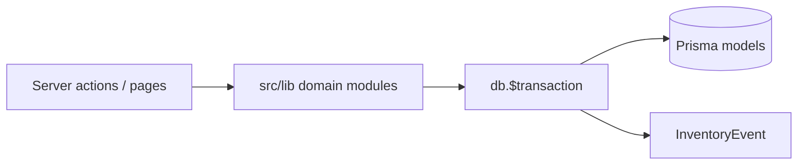
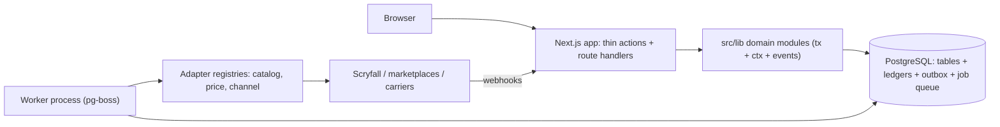

# Architecture Overview

How this system is structured today, what runways the parity backlog requires, and where the decisions are recorded.

Back to [backlog index](../BACKLOG.md) · [backlog conventions](../backlog/CONVENTIONS.md)

---

## Current state (Phases 1–3)

The app is a **Next.js 15 monolith** with **Prisma + PostgreSQL 16** (Docker). There is no authentication, no background worker, and no external write integrations — only read-only Scryfall lookups and manual Mana Pool CSV export.

### What works well

Domain logic lives in [`src/lib/<domain>/`](../../src/lib/) and is composed inside **`db.$transaction`**. Mutations write an append-only row to **`InventoryEvent`** via [`recordInventoryEvent(tx, ...)`](../../src/lib/events/record.ts). Failures return through typed error classes (`LifecycleError`, `RemoveBlockError`) to thin server actions in [`src/app/*/actions.ts`](../../src/app/).



This pattern is **correct and should be extended**, not replaced.

### Structural gaps

| Gap | Blocks |
|-----|--------|
| No background execution | PRC-002, CHN-004, GAM-005, A-007, BUY-007 |
| No reliable channel delivery | CHN-002, CHN-004, CHN-005, CHN-009 |
| No quantity concurrency pattern | SKU-003, POS-001, CHN-005, FUL-003 |
| Money as `Float`, actor never set | V-005, PRC-*, SKU-006, POS-003, ACC-003 |
| Vendor coupling (Scryfall direct) | GAM-002, PRC-001, CHN-008 |

These are not missing features — they are **missing foundations**. Building parity stories on top of the current shape will produce rework.

---

## Target shape (Phases 4–11)



The web app remains the primary UI. A **second Node process** drains scheduled jobs and the transactional outbox. External systems are reached only through **registered adapters**.

---

## Architecture Decision Records

| ADR | Decision | First implementer |
|-----|----------|-------------------|
| [ADR-001](adr/001-domain-module-convention.md) | Domain module convention (tx + events + typed errors) | **P-001** |
| [ADR-002](adr/002-actor-context-propagation.md) | Actor context propagated through domain calls | **P-001** threads; **ACC-001** populates |
| [ADR-003](adr/003-money-as-integer-cents.md) | Money stored as integer cents | **V-005** |
| [ADR-004](adr/004-append-only-ledger-pattern.md) | Append-only ledger for quantities and balances | **SKU-001** |
| [ADR-005](adr/005-reservation-and-availability-engine.md) | Single gatekeeper for reserve / release / available | **SKU-003** |
| [ADR-006](adr/006-background-worker-pg-boss.md) | Background worker on pg-boss (Postgres queue) | **PRC-002** |
| [ADR-007](adr/007-transactional-outbox-channel-sync.md) | Transactional outbox for channel sync | **CHN-002** |
| [ADR-008](adr/008-provider-adapter-registry.md) | Provider/adapter registry (catalog, price, channel) | **GAM-002** |
| [ADR-009](adr/009-protected-api-surface.md) | Protected API surface (session, webhooks, portals) | **ACC-001** |

Read an ADR before implementing the story named as its first implementer.

---

## Runway-to-phase mapping

| Phase | Stories | Runways to apply or build |
|-------|---------|---------------------------|
| **4** (next) | P-001, P-003, P-004, P-009 | **ADR-001**, **ADR-002** — conventions only; no new infrastructure |
| **5** | S-001, S-004, O-002 | Same conventions; search reads both inventory modes when SKU exists |
| **6** | ACC-*, V-005, SKU-* | **ADR-002** populated, **ADR-003**, **ADR-004**, **ADR-005**, **ADR-009** |
| **7** | GAM-*, SCN-* | **ADR-008** (catalog provider + cache) |
| **8** | PRC-* | **ADR-006** (worker for scheduled reprice) |
| **9** | CHN-* | **ADR-007** (outbox), **ADR-008** (channel adapters) |
| **10–11** | POS-*, BUY-*, FUL-* | Compose the above — no new runways |

Phases 10–11 are the **proof** that the runways were sufficient. If a POS or fulfilment story needs a new foundation, that indicates an ADR gap — add ADR-010 rather than bolting on ad hoc code.

---

## Module layout (target)

```
src/lib/
├── blocks/          # Chaos block domain (existing)
├── staging/         # Intake pipeline (existing)
├── events/          # InventoryEvent platform (existing)
├── context/         # Actor/session context (ADR-002) — Phase 4 thread, Phase 6 populate
├── money/           # Cents formatting and arithmetic (ADR-003) — Phase 6
├── stock/           # StockItem, movements, reservations (ADR-004, ADR-005) — Phase 6
├── catalog/         # Provider registry + CatalogCard cache (ADR-008) — Phase 7
├── pricing/         # Rule engine + price history (uses ADR-003, ADR-006) — Phase 8
├── channels/        # Outbox, adapters, reconciliation (ADR-007, ADR-008) — Phase 9
├── orders/          # Unified order queue — Phase 11
├── pick/            # Pick lists, allocation — Phase 4
└── jobs/            # pg-boss job definitions (ADR-006) — Phase 8
```

Worker entry (future): `src/worker/index.ts` — separate process, same repo, same `DATABASE_URL`.

---

## Conventions for new ADRs

When a story forces a cross-cutting decision:

1. Add `docs/architecture/adr/NNN-short-title.md` using the template in [ADR-001](adr/001-domain-module-convention.md).
2. Link it from this file's index table.
3. Reference it from the epic's schema notes or story block in `docs/backlog/`.
4. Name the **first story that implements** the decision — do not land code ahead of that story unless the ADR explicitly allows scaffolding.

---

## Related documents

| Document | Role |
|----------|------|
| [PARITY-SORTSWIFT.md](../backlog/PARITY-SORTSWIFT.md) | What parity requires and phasing rationale |
| [CONVENTIONS.md](../backlog/CONVENTIONS.md) | INVEST + Gherkin for stories |
| [AUDIT-2026-08.md](../backlog/AUDIT-2026-08.md) | Known defects (e.g. V-005) that block runways |
