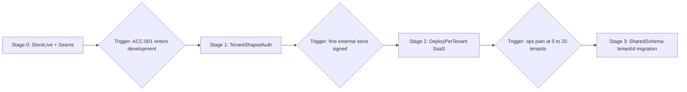

# ADR-010: Staged SaaS evolution strategy

| | |
|---|---|
| **Status** | Accepted |
| **Date** | 2026-08-08 |
| **First implementer** | **SAS-001** (Mandatory webhook and cron authentication) |

## Context

The system today is a deliberately single-tenant, self-hosted shop tool: one Next.js monolith, one PostgreSQL database, one Mana Pool account wired through process env, no auth ([ADR-009](009-protected-api-surface.md) accepted but not yet implemented). Roughly 40 files query through the shared Prisma client with no scoping key; business identifiers (`Block.blockId`, `Bin.binId`, `PickList.pickListId`, `ExternalOrder.manapoolOrderId`) are globally unique; ID sequences and `AppSetting` are singleton rows; backup, restore and danger-zone operations treat the whole database as the shop.

The owner intends to evolve this into a multi-tenant SaaS product **after** the store is live and the parity programme (Phases 6–11) delivers the functional surface. The risk being managed is not "we lack tenancy" — it is **accidentally accumulating code that makes tenancy a rewrite instead of a migration**.

## Decision

Tenancy is delivered in **stages pinned to business triggers, not calendar dates**. Until a trigger fires, no SaaS feature is built — but a small set of **tenancy seams** is enforced from now on so the eventual migration stays mechanical.

### Stage 0 — now: features first, seams enforced

No SaaS features. Five conventions apply to all new and touched code, enforced by [.cursor/rules/tenancy-seams.mdc](../../../.cursor/rules/tenancy-seams.mdc) and ESLint:

1. **All Prisma access lives in `src/lib` domain modules.** No new `@/lib/db` imports in pages, server actions or route handlers (ESLint `no-restricted-imports` guards this; pre-existing violators are grandfathered and migrated opportunistically).
2. **Every domain mutation takes `DomainContext`** (ADR-002). `tenantId` will later be added to that one interface.
3. **One credentials seam.** No new direct `process.env` reads for channel/marketplace credentials at call sites. The existing `getManaPoolConfigFromEnv()` is replaced by a `getChannelConfig(ctx, channel)` seam the next time channel code is touched (CHN-001 at the latest).
4. **No new global singletons or durable local state.** Sequences and settings stay as DB rows (they become per-tenant rows later); no in-process counters, no filesystem writes the app depends on.
5. **Destructive operations take an explicit scope argument** even while the only scope is "everything" — a wipe must never be ambiguous about what it wipes.

Additionally, inbound mutation surfaces **fail closed**: the Mana Pool webhook and cron routes refuse requests when their secrets are unconfigured (**SAS-001**, scheduled near-term — the webhook endpoint may already be internet-reachable).

### Stage 1 — trigger: ACC-001 enters development

Auth is the one subsystem too expensive to build twice. ACC-001 keeps its single-organisation scope, but its **design must be tenant-shaped**: one resolution seam produces `{ user, organisation }` and constructs `DomainContext`; roles attach to organisation membership, not to users globally. See the tenancy seam notes in [epic-20](../../backlog/epic-20-access-platform.md). The same rule applies to the pg-boss worker (ADR-006) and outbox (ADR-007): every job payload carries context; no job reads env credentials directly.

### Stage 2 — trigger: first external store commits

Go to market with **one deployment per tenant** — one container plus one database per store, exactly today's Docker shape. This is the strongest isolation model, requires zero schema rework, and defers the shared-schema investment until real revenue justifies it. Build only the thin shell: provisioning (**SAS-002**), central monitoring and backup (**SAS-003**), manual billing (**SAS-004**). ADR-009's protected surface must be fully implemented before anything is internet-facing for a customer.

### Stage 3 — trigger: deploy-per-tenant ops burden exceeds migration cost (typically 5–20 tenants)

Shared-schema migration, bounded because the seams held: add a `Tenant` model and `tenantId` on business tables with composite uniques (**SAS-005**); auto-inject scope via Prisma client extensions so domain call sites change mechanically; per-tenant encrypted channel credentials behind the Stage-0 seam (**SAS-006**); tenant-routed webhooks (**SAS-007**); tenant-scoped backup/restore/danger zone (**SAS-008**); self-serve onboarding and automated billing (**SAS-009**).

### Chartered decisions (2026-08-08, owner)

| # | Question | Decision |
|---|----------|----------|
| 1 | Existing direct Prisma calls in the app layer | **Opportunistic migration** — move a file's queries into `src/lib` whenever that file is touched for feature work; no dedicated refactor story |
| 2 | Enforcement of seam conventions | **Cursor rule + ESLint** `no-restricted-imports` ban on `@/lib/db` outside `src/lib`, with the nine pre-existing violators grandfathered in `eslint.config.mjs` |
| 3 | Optional webhook/cron secrets | **Harden now** — fail closed when secrets are unset; chartered as **SAS-001**, scheduled near-term rather than waiting for Stage 2 |
| 4 | Credentials seam timing | **Convention only** — build `getChannelConfig(ctx, channel)` when channel code is next touched (CHN-001 at the latest); no refactor now |

## Consequences

- **Positive:** the store launch and Phases 5–11 proceed untouched; the Stage 3 retrofit stays a bounded migration (schema + three modules) instead of a 40-file rewrite; the tenancy decision is made with real customer evidence at Stage 2, not speculation.
- **Negative:** deploy-per-tenant at Stage 2 means per-store ops (upgrades, backups, monitoring) until Stage 3; grandfathered app-layer queries persist until their files are touched.
- **Neutral:** ACC-001 gains design constraints but no scope growth; nothing in Phases 5–11 is reordered.

## Alternatives considered

| Alternative | Rejected because |
|-------------|------------------|
| Add `tenantId` / shared-schema tenancy now | Rewrites ~40 query sites, composite-keys every unique, and delays the store launch — all before a single external customer exists |
| Build SaaS shell (billing, onboarding, orgs) now | Speculative; every feature built pre-revenue risks being wrong, and none is needed to run the owner's store |
| Ignore tenancy until a customer signs | The corners (org-less auth, env credential reads at call sites, context-free jobs, scattered queries) are cheap to avoid and expensive to unwind |
| Shared-schema from first external tenant (skip Stage 2) | Pays the largest engineering cost at the moment of least validation; deploy-per-tenant serves 1–5 stores with today's code |

## Related stories

SAS-001 – SAS-009, ACC-001, ACC-002, CHN-001, CHN-007, PRC-002.

## References

- [epic-21-saas-platform.md](../../backlog/epic-21-saas-platform.md)
- [epic-20-access-platform.md](../../backlog/epic-20-access-platform.md)
- [ADR-002](002-actor-context-propagation.md) · [ADR-006](006-background-worker-pg-boss.md) · [ADR-007](007-transactional-outbox-channel-sync.md) · [ADR-009](009-protected-api-surface.md)
- [ARCHITECTURE.md](../ARCHITECTURE.md)
