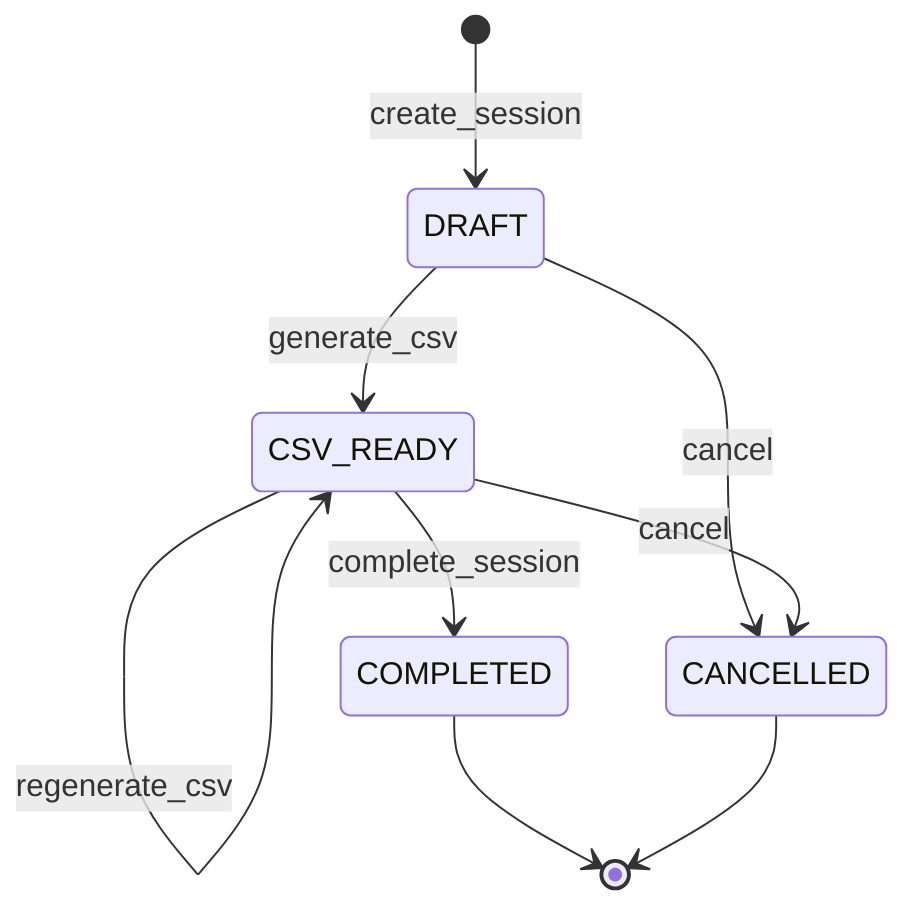

# ADR-013: Channel catalogs and upload sessions (block-mode listing)

| | |
|---|---|
| **Status** | Accepted |
| **Date** | 2026-08-09 |
| **First implementer** | **CHL-003** (upload session + reservations) |
| **Supersedes** | Draft “listing session mirrors staging” (LST) approach |

## Context

Chaos blocks (`Block` + `CardLine`) are packed and sealed before they are listed on a marketplace. Today (**PL-005**) staff download a **per-block** Mana Pool CSV from block detail and manually upload at manapool.com, then click **Mark as listed** (`SEALED → ACTIVE`) per block.

That does not scale when many sealed blocks are ready, does not reserve inventory during the external upload window, and does not express **which bins** feed which marketplace.

SortSwift parity (**CHN-***, **SKU-***) targets **per-SKU sellable stock** with live sync. This ADR covers **block-mode listing** only — the path shops use before sorted stock exists or for whole bricks that stay in chaos mode.

### Mana Pool import semantics

Per [Mana Pool CSV import docs](https://support.manapool.com/hc/en-us/articles/21894301054487-How-to-List-Cards-with-CSV-Imports):

- Import **adds to or updates** seller inventory — it does **not** replace the entire catalog.
- Re-importing the same printing **merges quantities** with existing rows.
- Price/qty updates for already-listed inventory use export → edit → re-import loops.

**Therefore:** upload sessions publish **new SEALED blocks only**. **ACTIVE** blocks are never included in a new session CSV — they are assumed already live on the marketplace.

### Pick gating gap today

[`src/lib/pick/allocate.ts`](../../../src/lib/pick/allocate.ts) treats **SEALED** and **ACTIVE** as pickable. A block reserved in an open upload session is still SEALED but must **not** be allocated until the session completes or cancels — otherwise orders could target inventory mid-upload that staff have not yet confirmed on Mana Pool.

## Decision

### Two layers — do not conflate

| Layer | Entity | Purpose |
|-------|--------|---------|
| **Configuration** | `ChannelCatalog` + bin membership | Long-lived grouping: which **bins** belong to which marketplace slice (e.g. shelf A → Mana Pool) |
| **Operation** | `UploadSession` + block membership | Short-lived publish pipeline: select **SEALED** blocks → generate CSV → reserve → external upload → **complete** → `ACTIVATE` |

Upload sessions are **not** staging imports. Staging creates inventory; upload sessions **publish** existing sealed blocks.

### Terminology (glossary)

| Term | Meaning |
|------|---------|
| **Card catalog** | Scryfall / `CatalogCard` (Epic 2/11) — card identity reference |
| **Channel catalog** | Bin → marketplace configuration |
| **Upload session** | Batch export + reservation + complete-to-ACTIVE |
| **Reserved block** | SEALED block linked to an open upload session |

### Upload session state machine



| Status | Meaning |
|--------|---------|
| `DRAFT` | Blocks selected and reserved; CSV not yet generated |
| `CSV_READY` | CSV generated; awaiting external upload + staff confirm |
| `COMPLETED` | Staff confirmed; blocks `ACTIVATED`; reservations cleared |
| `CANCELLED` | Abandoned; reservations cleared; blocks stay `SEALED` |

### Block eligibility for sessions

| Block status | May join open session? | In session CSV? | On complete |
|--------------|------------------------|-----------------|-------------|
| `OPEN` | No | No | — |
| `SEALED` | Yes (if not reserved elsewhere) | Yes | → `ACTIVE` |
| `ACTIVE` | No | No | — |
| `ARCHIVED` | No | No | — |
| `LIQUIDATED` | No | No | — |

Additional guards (see integrity matrix): quarantine (`pickHoldAt`), pick history constraints where applicable, empty listable lines.

### Reservation rules

1. A block may belong to **at most one** open upload session (`DRAFT` or `CSV_READY`).
2. Reserved blocks are **excluded from pick allocation** and counter-pick (**CHL-012**).
3. Cancel or complete **always** clears reservations in the same transaction as the status change.
4. Multiple staff may run **concurrent sessions** on **disjoint** block sets (block-level lock, not shop-wide mutex).

### Complete session semantics

- Staff explicitly confirms marketplace upload succeeded (human checkpoint — no API verification v1).
- Atomic transaction: all session blocks `SEALED → ACTIVE`, set `block.channel` to session channel, set `activatedAt` if unset, write `upload.completed` event, session → `COMPLETED`, clear reservations.
- **All-or-nothing** on complete: if any block fails validation, none activate.

### Channel catalog semantics

- Bins are assigned to a **channel catalog** per marketplace (`MANAPOOL`, `TCGPLAYER`, `EBAY` until **CHN-001** registry).
- A bin may belong to **at most one catalog per channel**; the **same bin may appear on different channels’ catalogs** (e.g. A-01 on both Mana Pool and TCGplayer catalogs — staff still choose which channel each upload session targets).
- Catalog membership is a **UI filter helper** — upload sessions **do not auto-include** all blocks in member bins; staff explicitly select blocks.
- Optional (**CHL-002**): blocks inherit **default channel hint** from bin on formalize/move; upload session **authoritative** channel is set on complete.

### Take offline (ARCHIVE) — v1 honesty

- App **Take offline** (`ACTIVE → ARCHIVED`) stops new picks from treating the block as active listing context.
- **No auto-delist** from Mana Pool v1 — staff manually adjust marketplace qty (export inventory → edit CSV → re-import) or use vacation mode.
- Document in [STORE-OPERATIONS.md](../../operations/STORE-OPERATIONS.md) (**CHL-013**).

### Export and audit

- CSV generation uses existing [`aggregateCardLinesForListing`](../../../src/lib/manapool/csv-export.ts) across session blocks; bulk lines without Scryfall ID excluded (**PL-005**).
- Regenerate CSV allowed while `CSV_READY`; audit row per generation (**CHL-011**).
- Manual CSV channels skip outbox (**ADR-007**).

### Future migration

- **CHN-001** channel registry subsumes `BlockChannel` enum.
- **CHN-005**: chaos block contents are **not** offered as auto-synced SKU available qty; promote (**SKU-004**) is the bridge.
- **CHN-006** stock-mode export is separate from block-mode upload sessions (`@dual`).

---

## Inventory integrity matrix

Each row: **trigger** → **risk** → **required guard** → **story**.

| # | Trigger | Integrity risk | Guard | Story |
|---|---------|----------------|-------|-------|
| I-01 | Block in open session | Order allocates mid-upload | Exclude reserved blocks from `allocateCardLineForOrderLine` | CHL-012 |
| I-02 | Block in open session | Second session includes same block | Unique partial index / txn check on open session membership | CHL-003, CHL-015 |
| I-03 | ACTIVE block selected | Double-list on Mana Pool (qty merge) | Reject ACTIVE at session create/add | CHL-003, CHL-015 |
| I-04 | Session CSV merges blocks | Mana Pool qty > any single block; pick from multiple ACTIVE | Expected — document; picks use `block.channel` + position | CHL-013, S-004 |
| I-05 | Complete without MP upload | App ACTIVE, marketplace not updated | UI confirmation copy; optional typed confirm; audit timestamp | CHL-005, CHL-015 |
| I-06 | Cancel after MP upload | Marketplace live, app still SEALED | Staff must not cancel after upload — UI warn on cancel when CSV_READY | CHL-006, CHL-015 |
| I-07 | Block removed during session | Session references ghost block | Reject block remove when reserved; or auto-remove from session with warning | CHL-015, B-012 |
| I-08 | Block moved during session | Bin/catalog drift | Allow move; session retains block by ID; warn if bin left catalog | CHL-015 |
| I-09 | Quarantine (`pickHoldAt`) | Bad inventory listed | Reject SEALED blocks on quarantine from session | CHL-015 |
| I-10 | Per-block ACTIVATE during session | Bypass session integrity | Reject ACTIVATE on reserved blocks; only complete session activates | CHL-015 |
| I-11 | ARCHIVE ACTIVE block | Mana Pool qty stale | ARCHIVE allowed; show delist checklist (manual MP) | CHL-013 |
| I-12 | OPEN block sealed mid-session | N/A — OPEN cannot be in session | Only SEALED at add time; re-validate at generate/complete | CHL-015 |
| I-13 | Regenerate CSV | Stale file uploaded | New audit row; UI shows generated-at timestamp | CHL-004, CHL-011 |
| I-14 | Concurrent complete | Double ACTIVATE | Idempotent complete; session row lock | CHL-005, CHL-015 |
| I-15 | Duplicate SKU in session + existing ACTIVE blocks | MP total qty exceeds unconfirmed chaos | Expected for MP merge; staff verify totals; future CHN-005 reconciliation | CHL-013 |
| I-16 | Counter-pick from reserved block | Physical pull vs listing | Counter-pick rejects reserved blocks | CHL-012 |
| I-17 | Order import before complete | Pick from wrong block | Reserved blocks skipped; may short until complete | CHL-012 |

---

## Schema notes (negotiable — first implementer CHL-003)

```text
ChannelCatalog       id, channel (BlockChannel), label, createdAt
ChannelCatalogBin    catalogId, binId          @@unique([catalogId, binId])
UploadSession        id, sessionId (UP-0001), channel, status, createdAt, completedAt, createdBy
UploadSessionBlock   sessionId, blockId, addedAt  @@unique([blockId]) where session open — enforce in app txn
UploadExportAudit    sessionId, rowCount, blockIds[], filename, createdAt, actor
```

`UploadSessionBlock` uniqueness for open sessions enforced in transaction (partial unique index if Postgres supports filtered unique, else app guard).

Optional on `Block`: `uploadSessionId` nullable FK for fast reservation lookup (denormalized from join).

Link `InventoryEvent.uploadSessionId` analogous to `stagingImportId`.

---

## Module layout

```
src/lib/channel-catalogs/   membership, filter, inherit
src/lib/upload-sessions/    create, generate-csv, complete, cancel, guards
```

Extend [`src/lib/pick/allocate.ts`](../../../src/lib/pick/allocate.ts) and [`counter-pick.ts`](../../../src/lib/pick/counter-pick.ts).

All mutations: `DomainContext`, `db.$transaction`, `recordInventoryEvent` (**ADR-001**, **ADR-002**, **ADR-010**).

---

## Consequences

### Positive

- Clear publish pipeline with reservation window closes pick/listing race for SEALED blocks.
- Bin catalogs match warehouse mental model without forcing SortSwift SKU model early.
- Mana Pool additive semantics respected — no accidental full-catalog replace.

### Negative

- Marketplace and app can **drift** until CHN sync (complete confirms app only).
- Merged CSV qty across blocks requires staff to understand pick may pull from multiple ACTIVE blocks (**I-04**).
- Extra entities and guards vs minimal per-block export.

### Neutral

- Per-block PL-005 export remains for ad-hoc use.
- CHN-006 block-mode templates extend same export functions later.

---

## Related

- [Epic 22 — Channel catalogs & upload sessions](../../backlog/epic-22-channel-catalogs.md)
- [ADR-007](007-transactional-outbox-channel-sync.md) — CSV skips outbox
- [ADR-005](005-reservation-and-availability-engine.md) — future SKU reservations; block reservation is session-scoped v1
- [INTAKE-STRATEGY.md](../../backlog/INTAKE-STRATEGY.md) — outbound mirror
- [STORE-OPERATIONS.md](../../operations/STORE-OPERATIONS.md) — listing runbook
