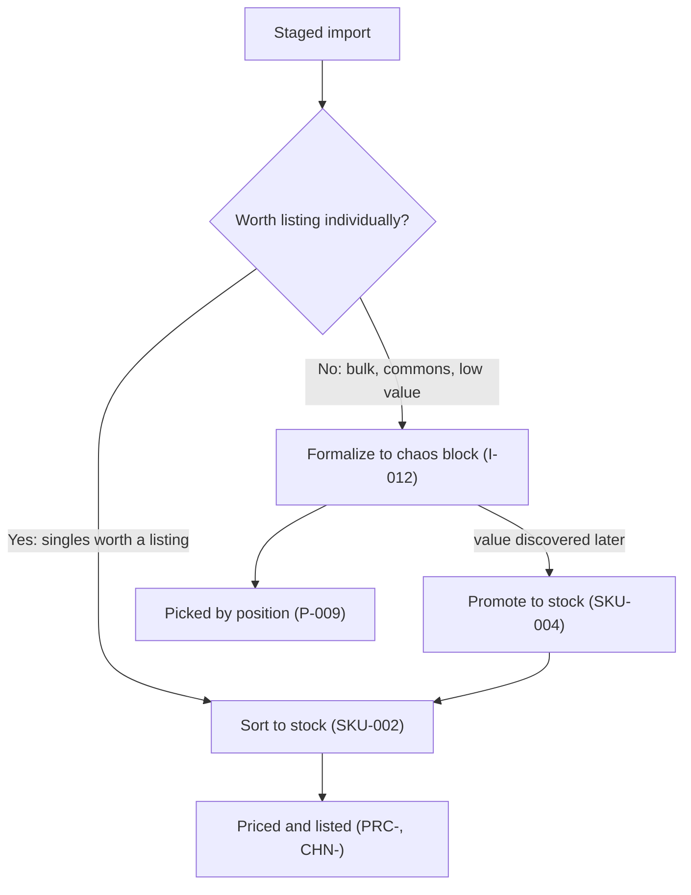

# Intake Strategy (design context)

**Read this first** when picking up intake or block-creation work. Captures product decisions from the trade-in workflow review (Aug 2026), extended with the dual inventory model (Aug 2026 parity review).

---

## Primary path: scan → CSV → staging (Done)

For store trade-ins and bulk chaos packing, **scan-first intake is the preferred workflow** — not manual card lookup in-app.

| Step | Who | Tool |
|------|-----|------|
| Identify card + printing | Scanner app | **ManaBox**, **Delver Lens**, or **TCGplayer** mobile / Scan & Identify |
| Validate condition, catch proxies/counterfeits, adjust wrong matches | **Human staff** | Visual inspection + condition tap at counter |
| Export identified list | Scanner app | CSV with Scryfall ID (ManaBox native; Delver Lens via export/converters) |
| Load into chaos system | This app | **Staging** → review breakdown → formalize → blocks |

Industry shop/inventory tools (TCGplayer Scan & Identify, SortSwift, TCG Sync, etc.) optimize for **camera/batch scan → human QC → inventory**, not typing card names from a catalog of tens of thousands of printings. Manual Scryfall search per card does not scale for trade-in volume.

**This app's staging pipeline (I-009–I-013) is the correct primary intake path.** `/intake` redirects to `/staging` by design.

Epic 12 (**SCN-**) brings scanning in-app for parity. It does not replace this path — the CSV bridge stays supported, because a dedicated scanner app on a phone will keep beating an in-browser camera for throughput.

---

## Human role at trade-in

Staff are **required** in the middle — but for **validation**, not identification from scratch:

- Set/adjust condition (NM/LP/MP/HP/DMG)
- Reject or flag proxies and counterfeits (scanners cannot detect these)
- Correct misidentified printings when the scanner offers candidates
- Accept/counter the trade and assign store credit

Do **not** plan trade-in throughput around staff manually searching Scryfall for every card.

Store credit at the counter is manual today. Epic 16 (**BUY-**) makes it a system function with rule-based offers and a payout record; until then, credit is tracked outside the app.

---

## The sort decision: chaos block or sorted stock

New in the dual model. At review time, each staged group goes to one of two destinations, and this is now an explicit choice rather than an assumption.

Rules of thumb for the destination, to be encoded as a default at **SKU-002** and always overridable:

| Signal | Destination |
|--------|-------------|
| Bulk commons, mixed low-value trade-in, mystery-box feedstock | **Chaos block** |
| Card above the shop's singles threshold, or already has channel demand | **Sorted stock** |
| Unknown value because pricing is unavailable | **Chaos block** — promote later; it is cheaper to promote one card than to sort a thousand |

**Promote, never copy.** Moving a card from a block to sorted stock decrements the block and writes a `StockMovement`; the two modes must never both claim the same physical card. This is the whole reason **SKU-004** is an audited action rather than a convenience button.

---

## Recovering from a bad scan (formalized too early)

When staff distrust the **scan/CSV** (not just one physical brick), the recovery path is **import-level**, not single-block remove:

| Situation | Preferred action | Story |
|-----------|------------------|-------|
| Still in staging (`PARSED`) — not formalized yet | Delete staging import; fix scan; re-upload CSV | **I-016** (Done) |
| Formalized (`ASSIGNED`) — question entire scan | **Undo formalize** (**I-023**) — one click removes all blocks + deletes import; re-upload export file | **I-023** (Done) |
| Formalized — scan trusted, one physical brick wrong | Single-block remove or move; optional partial repair | **I-015**, **I-021** (Should) |
| At pick — wrong card at position | Quarantine block, hold list, re-allocate; **not** undo import | **P-011–P-014** (Phase 4) |
| Cards already promoted to sorted stock | Reverse the promotion (**SKU-004** reversal), not undo formalize — the import no longer owns those units | **SKU-004** |

**Do not** require staff to remove blocks one-by-one (or use Settings "clear inventory") to redo a trade-in batch. Industry pattern (TCGplayer Scan & Identify batches): fix or discard the **working batch** before it is committed — formalize is the commit point.

**I-023** is **Done** — undo formalize is available on formalized staging review.

Once **CHN-** ships, undo gains a further guard: an import cannot be undone if any of its cards reached a live channel listing. Recorded on **CHN-005**.

---

## Exception path: manual block + card add (Deferred)

**I-001** (create OPEN block) and **I-002** (add cards via Scryfall) are **one bundled slice**, not separate deliverables. An empty OPEN block alone is a dead end (cannot seal, cannot export for Mana Pool, cannot pick).

Ship together only when a concrete **non-CSV** use case justifies the build:

- Small ad-hoc batch (no scanner handy)
- Single overflow brick after a CSV formalize
- Bulk-only brick via **C-005** bulk line (no per-card lookup)
- Post-formalize correction / repair (prefer **I-005** set+collector quick-add or staging row fix first)

**Not** the trade-in counter workflow. Priority lowered to **Should**; deferred past Phase 3 core lifecycle work.

---

## Scryfall in this codebase today

| Capability | Status | Used for |
|------------|--------|----------|
| Search + set/collector lookup ([`lib/scryfall.ts`](../../src/lib/scryfall.ts)) | Partial (**C-001**) | ManaBox CSV enrichment, `/api/cards/search` |
| In-app card selection UI on block detail | — (**I-002**) | Not built; exception/repair only when built |
| Local Scryfall cache | — (**C-004**) | Not built |
| Price capture | **Broken** (**V-005**) | Fetched at parse, discarded at formalize — see [`AUDIT-2026-08.md`](AUDIT-2026-08.md) |

Scryfall is MTG-only. Epic 11 (**GAM-**) puts it behind a catalog provider interface so other games can be added without rewriting intake.

---

## Intake story priority summary

| Tier | Stories | When |
|------|---------|------|
| **Primary (Done)** | I-009–I-013, I-016, I-017 | ManaBox CSV through formalize |
| **Primary polish** | I-018, I-024, I-025 | All Done — default bin at formalize; list badges; manual upload→review navigation |
| **Post-formalize lifecycle** | I-003, B-002 (both Done), I-015 Partial | Phase 3 — **B-007** deferred (manual team-bag labels) |
| **I-015 hardening (QA)** | PL-008, B-012, B-013, B-010, B-011, I-022, I-023 all Done; I-021 Should; B-014–B-018 open | Phase 3a |
| **Exception intake (bundle)** | I-001 + I-002 (+ optional I-005, bulk line UI) | Phase 3b — defer until needed |
| **Sort destination** | SKU-002, SKU-004 | Phase 6 — chaos vs sorted decision at review |
| **Scan parity** | SCN-001 – SCN-006 | Phase 7 — supersedes I-006 and I-014 |
