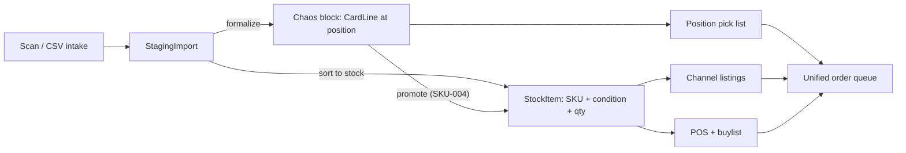

# SortSwift Feature Parity — Gap Matrix

Target: SortSwift, an all-in-one TCG inventory and shop operating system covering intake → organization → pricing → multi-channel selling → fulfillment.

Baseline: this codebase as of August 2026 — see [`AUDIT-2026-08.md`](AUDIT-2026-08.md) for verified statuses.

---

## The architectural decision

SortSwift's core promise is **never oversell**: one per-SKU quantity, synced live to every channel. A chaos block is the deliberate opposite — a sealed brick where `CardLine.position` is the only address, and contents are not individually sellable until a picker physically pulls them.

Both promises are worth keeping. They cannot share one table without breaking one of them, so this system runs **two inventory modes side by side**.

| | Chaos bulk mode | Sorted stock mode |
|---|---|---|
| **Model** | `Block` + `CardLine` | `StockItem` + `StockMovement` (Epic 10) |
| **Address** | `MTG-0007` position 14 | Shelf / bin / row |
| **Good for** | High-volume trade-in, bulk lots, mystery product, cards not worth sorting | Singles worth listing individually |
| **Sellable live** | No — brick is sealed, picked by position | Yes — quantity syncs to channels |
| **Oversell risk** | None, nothing is listed per-card | Real — this is what Epic 14 must guard |

A physical card is in exactly one mode at a time. Moving between them is the explicit, audited **promote** action (**SKU-004**). SortSwift itself only has the second mode; the first is this system's differentiator and is not being given up for parity.

---

## Gap matrix

Status uses the keys in [`CONVENTIONS.md`](CONVENTIONS.md). "Target" names the epic that closes the gap.

### 1. Card scanning & intake

| SortSwift capability | Status | Evidence / gap | Target |
|---|---|---|---|
| CSV / file upload intake | **Done** | ManaBox and generic CSV via [`csv-import.ts`](../../src/lib/manabox/csv-import.ts) | — |
| Staging area before live inventory | **Done** | `StagingImport` → review → formalize | — |
| Review / staging before commit | **Done** | `/staging/[importId]`, undo formalize | — |
| Chaos sorting of mixed piles | **Partial** | Mixed sets and conditions accepted in one CSV, but the pile must be scanned by an external app first | **SCN-** |
| 26+ TCGs | **—** | MTG only; Scryfall is the sole catalog | **GAM-** |
| Phone / web camera scanning | **—** | No camera path; **I-006**, **I-014** deferred | **SCN-** |
| Auto-identify set, printing, foil, language, condition | **Partial** | Set, printing, foil, language come from the CSV; condition is human-set in the scanner app and mapped at import (ADR-012, **C-007**); nothing is identified from an image | **SCN-** |
| Alternate printing picker | **—** | No candidate UI; a wrong match must be fixed in the source CSV | **SCN-** |
| Front/back image association | **Partial** | `imageUri` persists through formalize (**V-005**); scan UI and stock listing resolution not built | **SCN-006**, **SKU-011** |
| Live price overlay during scan | **—** | No price shown at intake | **SCN-**, **PRC-** |
| Mobile app | **—** | Responsive web only | **ACC-** (parked) |
| Hardware sifters / sorters | **—** | None | Parked |

### 2. Inventory management

| SortSwift capability | Status | Evidence / gap | Target |
|---|---|---|---|
| Condition-aware tracking | **Done** | `Condition` NM/LP/MP/HP/DMG, `Finish`, language on every line | — |
| Location-based storage | **Done** | Shelf → Bin → Block, unlimited bins, move/reassign | — |
| Full audit trail | **Done** | `InventoryEvent` + `/activity` | — |
| Change history with actor | **Partial** | Events are recorded; `actor` is nullable and never written — no users exist | **ACC-001** |
| Per-SKU sellable quantity | **—** | Cards are only addressable by block position | **SKU-** |
| Real-time quantity sync / oversell prevention | **—** | Nothing syncs | **SKU-**, **CHN-** |
| Sealed product & accessories / custom SKUs | **—** | Singles only | **SKU-008** |
| Cost basis, margin, valuation | **Partial** | Market price persists (**V-005**); no cost column | **SKU-006** |
| Inventory aging | **Done** (blocks) | `/analytics` aging buckets — for blocks, not SKUs | **RPT-** for SKU aging |
| Barcode / SKU generation | **—** | Block IDs are human-readable but not encoded; **B-007** deferred | **B-007**, **SKU-007** |
| Picklist generation | **—** | `/pick` is a stub | **P-001** (Phase 4) |
| Multi-location & stock transfers | **Partial** | Blocks move between bins; no transfer workflow, no warehouse tier | **O-002**, **SKU-005** |
| CSV import/export/reprice with marketplace templates | **Partial** | One export template (Mana Pool), one import shape (ManaBox) | **CHN-006** |
| 100,000+ SKU scale | **Unproven** | Validated at 5k cards per import; no SKU table to scale yet | **SKU-** |

### 3. Autopricing & market data

| SortSwift capability | Status | Evidence / gap | Target |
|---|---|---|---|
| Any persisted price | **Done** | `priceCents` on staging and card lines (**V-005**) | — |
| Scheduled market refresh | **—** | Prices are never refreshed | **PRC-002** |
| Multi-step rule engine | **—** | None | **PRC-003** |
| Floors, margins, condition & rarity multipliers, rounding | **—** | None | **PRC-003**, **PRC-004** |
| Per-channel price config | **—** | None | **PRC-006** |
| Price history | **—** | None | **PRC-005** |
| Bulk repricing | **—** | None | **PRC-007** |
| Rule tester / sample tool | **—** | None | **PRC-008** |
| Multiple price sources | **—** | Scryfall only | **PRC-001** |

### 4. Multi-channel syncing

| SortSwift capability | Status | Evidence / gap | Target |
|---|---|---|---|
| Channel concept | **Schema** | `BlockChannel` enum is a label with no behaviour | **CHN-001** |
| Listing push | **Partial** | Manual: per-block Mana Pool CSV (PL-005); **Phase 5b** upload sessions + bin catalogs (**CHL-***) | **CHN-002** (API); block CSV path stays for bricks |
| Shopify / eBay / TCGplayer / CardTrader / Square / Walmart | **—** | No outbound API calls exist anywhere in `src/` | **CHN-** |
| Quantity reconciliation both directions | **—** | None | **CHN-004** |
| Oversell guard | **—** | None | **CHN-005** |
| Per-channel rules | **—** | None | **PRC-006**, **CHN-003** |
| Unified order management | **Schema** | `ExternalOrder` models exist; `/orders` is a stub | **FUL-001** |

### 5. Point of sale

Nothing exists. Whole category is **CHN**-adjacent greenfield: cart, barcode scan, split tender, store credit, tax, receipts, kiosk, events, staff roles. Target **POS-**, gated behind **ACC-** (a till without a cashier identity is not auditable).

### 6. Buylist

Nothing exists in software. The trade-in *process* is documented in [`INTAKE-STRATEGY.md`](INTAKE-STRATEGY.md) and happens at the counter with an external scanner app; the system only sees the resulting CSV. Target **BUY-**.

### 7. Orders, shipping & fulfillment

| SortSwift capability | Status | Evidence / gap | Target |
|---|---|---|---|
| Order model | **Schema** | `ExternalOrder`, `ExternalOrderLine` | **FUL-001** |
| Order import | **Stub** | `/orders` placeholder; Mana Pool API documented in Settings, not implemented | **FUL-002** |
| Pick list | **Stub** | `/pick` placeholder; Phase 4 stories written | **P-001**+ |
| Auto-deduction on sale | **—** | Nothing decrements | **P-004**, **SKU-003** |
| Shipping labels, tracking, returns | **—** | None | **FUL-004** – **FUL-006** |

### 8. Consignment

Nothing exists. Parked — **CON-**.

### 9. Reporting & analytics

| SortSwift capability | Status | Evidence / gap | Target |
|---|---|---|---|
| Block aging dashboard | **Done** | `/analytics`, aging buckets, stale list | — |
| Inventory valuation | **Partial** | Dashboard, blocks, analytics sum `priceCents`; no sealed snapshot (**V-002**) | **V-002** |
| Sales / margin / channel reports | **—** | No sales data exists to report on | **RPT-** |
| CSV report export | **—** | Only the per-block listing CSV and JSON backup | **RPT-005** |
| Deck tools, store map, public API | **—** | None | Parked |
| Data retention policy | **Done** | Local Postgres, explicit danger-zone deletes only | — |

### 10. Architecture & operations

| SortSwift capability | Status | Evidence / gap | Target |
|---|---|---|---|
| Self-hosted, no commission | **Done** | Local Docker + Postgres; no platform takes a cut | — |
| Backup / restore | **Done** | JSON export, wipe-and-restore | — |
| Users, roles, permissions | **—** | No auth of any kind; no `User` model, no middleware | **ACC-001** – **ACC-003** |
| Audit actor | **Partial** | Event log exists; no identity to record | **ACC-001** |
| Modular / à-la-carte features | **—** | Monolithic; every page always on | **ACC-005** |
| Current catalog for new sets | **Partial** | Scryfall is live and current, but MTG only and uncached (**C-004**) | **GAM-**, **C-004** |
| Web + mobile parity | **Partial** | Responsive web; no native app | Parked |
| External API | **—** | Internal routes only | Parked |

---

## Parity phasing

Ordered so each phase is usable on its own and unblocks the next. Rationale matters more than the list — the ordering is driven by three hard dependencies:

- **Nothing is auditable without an actor.** Every parity feature writes money-affecting events. `ACC-` comes first.
- **Nothing can be priced or sold without a persisted price and a sellable quantity.** **V-005** shipped; **SKU-** is next.
- **Nothing can sync without a price rule and a quantity to sync.** `PRC-` then `CHN-`.

| Phase | Epics | Delivers |
|-------|-------|----------|
| **6** | `ACC-001` – `ACC-003`, `SKU-001` – `SKU-006` | Login, roles, event actor; a real per-SKU stock ledger with cost basis and promote-from-block |
| **7** | `GAM-`, `SCN-` | Multi-game catalog behind a provider interface; scan review parity with alternate-printing picker and price overlay |
| **8** | `PRC-` | Rule-based autopricing with history, refresh, bulk reprice and a rule tester |
| **9** | `CHN-` | Channel registry, CSV templates for 20+ marketplaces, one live API channel, oversell guard |
| **10** | `POS-`, `BUY-` | Counter sales with store credit; customer buylist submissions feeding stock |
| **11** | `FUL-` | Unified order queue across POS, buylist and channels; labels, tracking, returns |
| **Parked** | `CON-`, `RPT-` advanced, kiosk, events, hardware, public API, native mobile | Revisit when phases 6–11 are in production use |

Phases 1–5 (MTG chaos core, including Phase 4 picking) are unchanged and continue in parallel. Phase 4 picking is a **prerequisite** for `FUL-` and should land before Phase 11.

### Minimum viable parity

SortSwift's own framing of the shortest credible path is chaos scanning + condition/location-aware inventory + multi-channel sync + rule-based autopricing + basic POS + CSV tools. Against this codebase that is **phases 6 through 10** — roughly `ACC-`, `SKU-`, `SCN-`, `PRC-`, `CHN-` and the first `POS-` slice. Buylist, unified orders, kiosk and advanced reporting close the remaining distance.

### What is deliberately not pursued

| SortSwift feature | Why not |
|---|---|
| Hardware sorters (Super Sorter) | Capital equipment, not software; chaos blocks exist precisely to avoid sorting |
| Free-tier / commission model | Self-hosted; there is no platform to take a commission |
| Native iOS/Android app | Responsive web covers counter and shelf use; revisit only if camera scan (**SCN-**) proves unusable in a mobile browser |
| Store locator, deck tools, leaderboards | Customer-facing marketing surface, no inventory value |
